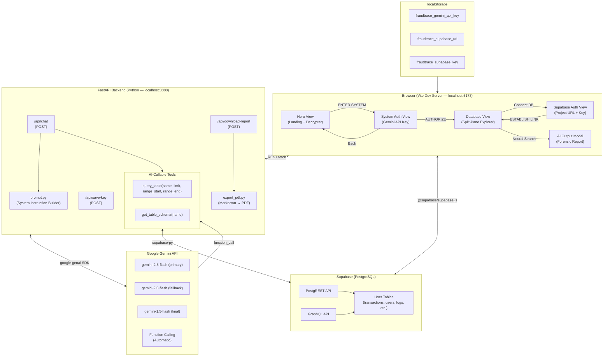
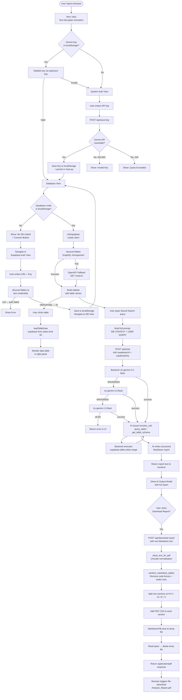
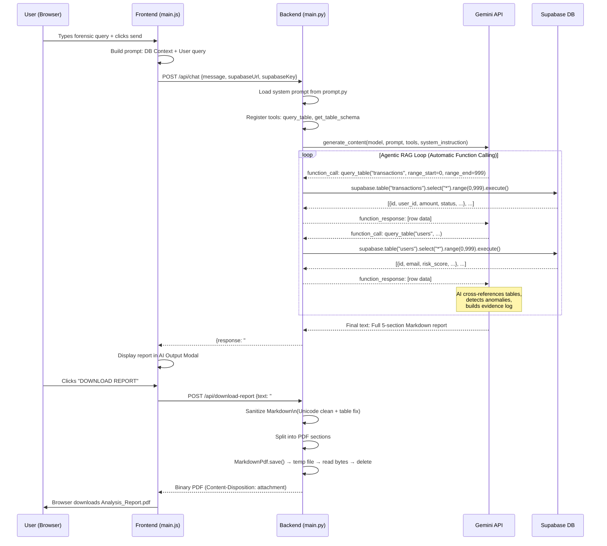

# FraudTrace.io

> **AI-Powered Database Forensics & Fraud Detection Platform**

FraudTrace.io is a full-stack forensic intelligence tool that connects to any Supabase database, performs deep agentic RAG (Retrieval-Augmented Generation) analysis using Google Gemini AI, and generates structured, professional-grade forensic PDF reports — all through a stunning noir-aesthetic web interface.

---

## Table of Contents

- [Overview](#overview)
- [Key Features](#key-features)
- [Architecture](#architecture)
- [Project Structure](#project-structure)
- [Tech Stack](#tech-stack)
- [How It Works — Step by Step](#how-it-works--step-by-step)
- [Application Flow Diagram](#application-flow-diagram)
- [Data Flow: AI Forensic Analysis](#data-flow-ai-forensic-analysis)
- [API Reference](#api-reference)
- [Installation & Local Development](#installation--local-development)
- [Environment & Configuration](#environment--configuration)
- [PDF Report Structure](#pdf-report-structure)
- [License](#license)

---

## Overview

FraudTrace.io is a dual-process application — a **Vite-powered frontend** served on `localhost:5173` and a **FastAPI Python backend** running on `localhost:8000`. Users authenticate with a Google Gemini API key, connect their Supabase project, then issue natural language forensic instructions. The AI backend autonomously queries the live database using function-calling tools, performs cross-table reconciliation, and returns a fully structured Markdown forensic report that can be exported as a professional PDF.

The system is designed for:

- **Security analysts** auditing transactional anomalies
- **Compliance teams** running automated forensic sweeps
- **Developers** investigating data integrity issues across Supabase projects

---

## Key Features

| Feature | Description |
|---|---|
| **Neural Link Authentication** | Validates a Google Gemini API key against the live API before storing it locally |
| **Schema-Agnostic DB Discovery** | Automatically discovers all table schemas via GraphQL introspection or OpenAPI fallback |
| **Split-Pane Database Explorer** | Browse live table data (up to 50 rows preview per table) in a terminal-style UI |
| **Agentic RAG Analysis** | AI autonomously issues `query_table` and `get_table_schema` function calls against the live database |
| **Multi-Model Fallback Chain** | Tries Gemini models in priority order; gracefully degrades on 404/429/503 errors |
| **Structured Forensic Reports** | Five-section Markdown report: Executive Summary → Methodology → Evidence Log → Reconciliation Table → Recommendations |
| **In-Memory PDF Export** | Converts AI Markdown output to a professional grayscale PDF with proper table formatting and page-break control |
| **Decrypter Hero Animation** | Cinematic text scramble animation on the landing page |
| **Neo-Brutalist UI** | High-contrast, monospaced, dark-mode aesthetic with cyan/magenta micro-animations |

---

## Architecture



---

## Project Structure

```
FraudTrace/
│
├── index.html                  # Application entry point (single-page app shell)
│
├── src/                        # Frontend source (Vite module graph)
│   ├── main.js                 # ALL application logic — views, auth, DB explorer, AI chat, PDF export trigger
│   ├── style.css               # Noir neo-brutalist design system (987 lines)
│   ├── counter.js              # Vite scaffold remnant (unused)
│   │
│   ├── lib/
│   │   ├── supabase.js         # Lazy-initialized Supabase client with Proxy pattern
│   │   ├── supabase.ts         # TypeScript type placeholder (env-var based config, legacy)
│   │   └── database.ts         # Typed helper functions for specific tables (transactions, users, fraud_alerts, logs)
│   │
│   └── assets/
│       ├── hero.png            # Landing page hero image asset
│       ├── javascript.svg      # Vite scaffold icon
│       └── vite.svg            # Vite scaffold icon
│
├── public/
│   ├── favicon.svg             # FraudTrace favicon
│   └── icons.svg               # UI icon sprite sheet
│
├── main.py                     # FastAPI backend — 3 REST API endpoints + Supabase tools for AI
├── prompt.py                   # AI system prompt factory — defines the "Neural Database Investigator" persona and 5-section report format
├── export_pdf.py               # PDF generation service — Markdown sanitization + markdown_pdf rendering
├── styles.css                  # PDF-specific CSS (grayscale, page margins, table borders, page-break rules)
│
├── migrations/                 # Supabase migration directory (empty — schema managed externally)
│
├── requirements.txt            # Python dependencies
├── package.json                # Node.js project config (Vite + @supabase/supabase-js)
├── package-lock.json           # Lockfile
└── .gitignore                  # Excludes node_modules, __pycache__, .env
```

---

## Tech Stack

### Frontend

| Technology | Role |
|---|---|
| **Vite 8** | Build tool and dev server (ESM-native, HMR) |
| **Vanilla JavaScript** | All UI logic, event handling, view state machine |
| **Vanilla CSS** | Custom design system — no framework |
| **@supabase/supabase-js v2** | Direct DB reads for the table preview panel |
| **Space Grotesk** (Google Fonts) | Primary typeface |

### Backend

| Technology | Role |
|---|---|
| **FastAPI** | Async Python REST API |
| **Uvicorn** | ASGI server |
| **google-genai** | Official Google AI Python SDK (function calling, async) |
| **supabase-py** | Server-side Supabase client for AI tool calls |
| **markdown-pdf** | Markdown to PDF conversion engine |
| **httpx** | Async HTTP client for Gemini API requests |

---

## How It Works — Step by Step

### Step 1 — Hero Landing

The user lands on the cinematic hero screen. The `TextDecrypter` class runs a `requestAnimationFrame` animation loop that scrambles `FRAUD TRACE` using a set of glitch characters (`!<>-_\/[]{}—=+*^?#`), then progressively reveals the correct characters over 2 seconds. Once complete, the "ENTER SYSTEM" CTA button fades in.

### Step 2 — Gemini Neural Link Authentication

Clicking "ENTER SYSTEM" transitions to the **System Auth View**. The user pastes their Google Gemini API key. On "AUTHORIZE":

1. The frontend POSTs `{ apiKey }` to `/api/save-key`.
2. The backend creates a `genai.Client`, sends a test `generate_content("Verify connection")` call to `gemini-1.5-flash` with retry logic (3 attempts, exponential backoff).
3. On success, the backend **rewrites its own source file** (`main.py`) using `re.sub` to persist the API key in the `API_KEY` constant, and updates the module-level global.
4. The key is also saved to `localStorage` as `fraudtrace_gemini_api_key`.

### Step 3 — Supabase Database Connection

After authentication, the user is taken to the **Database View**. If no Supabase credentials are stored, they navigate to the **Supabase Auth View** and enter:

- **Project URL** (e.g., `https://xyz.supabase.co`)
- **Publishable/Anon Key**

The `discoverTables()` function runs a two-tier schema discovery:

1. **GraphQL Introspection** — POSTs `{ __schema { types { name kind fields { name } } } }` to `/graphql/v1`. Filters for `OBJECT` types, excludes internal/relay types (`__`, `Query`, `Mutation`, `PageInfo`, `*Connection`, `*Edge`, etc.).
2. **OpenAPI Fallback** — GETs `/rest/v1/` and parses the OpenAPI spec's `definitions` or `components.schemas`.

Credentials are persisted to `localStorage`.

### Step 4 — Database Explorer

The **Split-Pane Explorer** renders with:

- **Left sidebar** — all discovered table names, clickable
- **Right panel** — paginated data table (max 50 rows per table, via `supabase.from(tableName).select('*').limit(50)`)

Stats bar shows: total table count, Neural Status = Active, Access Level = Root.

A `databaseSummary` string is assembled containing the schemas of the top 10 tables and names of all remaining tables. This context is injected into every AI analysis prompt.

### Step 5 — Neural Search (AI Forensic Analysis)

The user types a forensic query in the Neural Search bar (e.g., *"Find all suspicious transactions over $10,000 in the last 30 days and cross-reference with user accounts"*). On submit:

1. Frontend builds: `"DATABASE CONTEXT:\n{databaseSummary}\n\nUSER QUERY:\n{query}"` and POSTs to `/api/chat`.
2. Backend instantiates a `genai.Client` with `httpx.AsyncClient(timeout=60s)`.
3. System prompt (from `prompt.py`) configures the AI as the **"Neural Database Investigator"** — a forensic persona with strict output format requirements.
4. Two tool functions are registered: `query_table` and `get_table_schema`. Automatic function calling is enabled.
5. The backend tries models in this order:
   - `gemini-2.5-flash`
   - `gemini-2.0-flash`
   - `gemini-1.5-flash`
6. The AI autonomously decides which tables to query, issues function calls (which execute live Supabase queries on the server), receives the data, and loops until it has enough evidence to write the full report.
7. The structured Markdown report is returned to the frontend.

### Step 6 — Report Display & PDF Export

The AI report appears in the **Output Modal**. The "DOWNLOAD REPORT" button POSTs the raw Markdown text to `/api/download-report`:

1. `clean_text_for_pdf()` normalises Unicode curly quotes, em-dashes, etc. to ASCII equivalents.
2. `sanitize_markdown_tables()` strips any accidental code fences around tables and removes bullet-point prefixes (`*`, `-`, `•`) from table rows.
3. The report is split into sections at `## **II.`, `## **III.`, `## **IV.`, `## **V.` headings. Each section becomes a separate `MarkdownPdf.Section`, enabling controlled page breaks.
4. Each section is prefixed with the PDF CSS (`styles.css`) to enforce professional grayscale table styling.
5. The PDF is rendered to a temp file, read into bytes, the temp file deleted, and the bytes returned as a binary `application/pdf` HTTP response.
6. The frontend creates a blob URL and triggers a browser download as `Analysis_Report.pdf`.

---

## Application Flow Diagram



---

## Data Flow: AI Forensic Analysis



---

## API Reference

### `POST /api/save-key`

Validates and persists a Gemini API key.

**Request Body:**

```json
{ "apiKey": "AIza..." }
```

**Success Response:**

```json
{ "status": "success" }
```

**Error Responses:**

```json
{ "error": "Invalid API Key or Permission Denied. (...)" }
{ "error": "API Quota exceeded or rate limited: ..." }
{ "error": "Connection stability issue after 3 attempts." }
```

---

### `POST /api/chat`

Runs an agentic forensic analysis against the connected Supabase database.

**Request Body:**

```json
{
  "message": "DATABASE CONTEXT:\n...\n\nUSER QUERY:\nFind all transactions over $50,000",
  "supabaseUrl": "https://xyz.supabase.co",
  "supabaseKey": "sb_publishable_..."
}
```

**Success Response:**

```json
{
  "response": "# FraudTrace: AI-Powered Database Analysis Report\n\n## I. Executive Summary\n..."
}
```

**Error Responses:**

```json
{ "error": "Supabase credentials missing. Please connect your database first." }
{ "error": "Neural Link failure: ..." }
{ "error": "All available models exhausted or rate limited." }
```

---

### `POST /api/download-report`

Converts Markdown report text to a downloadable PDF binary.

**Request Body:**

```json
{ "text": "# FraudTrace: AI-Powered Database Analysis Report\n..." }
```

**Success Response:** Binary `application/pdf` with header:

```
Content-Disposition: attachment; filename=Analysis_report.pdf
```

**Error Response:**

```json
{ "error": "Failed to generate report: ..." }
```

---

## Installation & Local Development

### Prerequisites

- **Python 3.10+** with `pip`
- **Node.js 18+** with `npm`
- A **Google Gemini API key** — get one at [aistudio.google.com](https://aistudio.google.com/app/apikey)
- A **Supabase project** — get credentials at [supabase.com/dashboard](https://supabase.com/dashboard/project/_/settings/api)

### 1. Clone the Repository

```bash
git clone https://github.com/<your-org>/FraudTrace.git
cd FraudTrace
```

### 2. Install Python Dependencies

```bash
pip install -r requirements.txt
```

### 3. Install Node.js Dependencies

```bash
npm install
```

### 4. Start the Backend

```bash
python main.py
```

> Backend runs on `http://127.0.0.1:8000`

### 5. Start the Frontend (separate terminal)

```bash
npm run dev
```

> Frontend runs on `http://localhost:5173`

### 6. Open the App

Navigate to **[http://localhost:5173](http://localhost:5173)** in your browser.

---

## Environment & Configuration

FraudTrace uses a **no-`.env`-file** approach by design. All sensitive credentials are:

| Credential | Storage Location |
|---|---|
| Gemini API Key | `localStorage` (`fraudtrace_gemini_api_key`) + auto-patched into `main.py` |
| Supabase Project URL | `localStorage` (`fraudtrace_supabase_url`) |
| Supabase Publishable Key | `localStorage` (`fraudtrace_supabase_key`) |

> **Note:** The self-modifying `API_KEY` pattern in `main.py` is an embedded convenience mechanism for local use. For production deployments, replace this with a proper environment variable or secrets manager.

### AI Model Priority Chain

The backend cycles through these models automatically on failure:

```
gemini-3.1-flash → gemini-3.1-flash-lite-preview → gemini-2.5-flash → gemini-2.0-flash → gemini-1.5-flash
```

Fallback triggers on HTTP status codes: `404`, `429`, `503` and errors matching: `NOT_FOUND`, `quota`, `exhausted`, `UNAVAILABLE`, `demand`, `deadline`, `timed out`, `timeout`.

---

## PDF Report Structure

Every AI analysis produces a five-section forensic report:

| Section | Content |
|---|---|
| **I. Executive Summary** | High-level multi-paragraph analysis of the database ecosystem vulnerability, fraud sophistication, and long-term operational impact |
| **II. Audit Methodology** | Scan depth, dataset analysis, retrieval logic (SQL-like filters + range parameters used), forensic integrity statement |
| **III. Comprehensive Evidence Log** | Per-case deep analysis: Risk Score (1–10), Primary Evidence (raw values + timestamps), Behavioral Analysis (deviation from normal), Pattern of Fraud (attack type classification) |
| **IV. Data Reconciliation Table** | Full GFM Markdown table — Case ID, Client ID, Frauded Account, Total Scammed, Timestamp, Security Status. Every detected case must appear |
| **V. Expert Recommendations** | 7–10 specific, technical, and actionable security and fraud prevention recommendations |

The PDF renderer splits the report at each `##` section heading to ensure clean page breaks and prevent the reconciliation table from being split across pages.

---

## License

```
                                 Apache License
                           Version 2.0, January 2004
                        http://www.apache.org/licenses/

   TERMS AND CONDITIONS FOR USE, REPRODUCTION, AND DISTRIBUTION

   1. Definitions.

      "License" shall mean the terms and conditions for use, reproduction,
      and distribution as defined by Sections 1 through 9 of this document.

      "Licensor" shall mean the copyright owner or entity authorized by
      the copyright owner that is granting the License.

      "Legal Entity" shall mean the union of the acting entity and all
      other entities that control, are controlled by, or are under common
      control with that entity. For the purposes of this definition,
      "control" means (i) the power, direct or indirect, to cause the
      direction or management of such entity, whether by contract or
      otherwise, or (ii) ownership of fifty percent (50%) or more of the
      outstanding shares, or (iii) beneficial ownership of such entity.

      "You" (or "Your") shall mean an individual or Legal Entity
      exercising permissions granted by this License.

      "Source" form shall mean the preferred form for making modifications,
      including but not limited to software source code, documentation
      source, and configuration files.

      "Object" form shall mean any form resulting from mechanical
      transformation or translation of a Source form, including but
      not limited to compiled object code, generated documentation,
      and conversions to other media types.

      "Work" shall mean the work of authorship made available under
      the License, as indicated by a copyright notice that is included in
      or attached to the work (an example is provided in the Appendix below).

      "Derivative Works" shall mean any work, whether in Source or Object
      form, that is based on (or derived from) the Work and for which the
      editorial revisions, annotations, elaborations, or other transformations
      represent, as a whole, an original work of authorship. For the purposes
      of this License, Derivative Works shall not include works that remain
      separable from, or merely link (or bind by name) to the interfaces of,
      the Work and Derivative Works thereof.

      "Contribution" shall mean, as submitted to the Licensor for inclusion
      in the Work by the copyright owner or by an individual or Legal Entity
      authorized to submit on behalf of the copyright owner. For the purposes
      of this definition, "submitted" means any form of electronic, verbal,
      or written communication sent to the Licensor or its representatives,
      including but not limited to communication on electronic mailing lists,
      source code control systems, and issue tracking systems that are managed
      by, or on behalf of, the Licensor for the purpose of discussing and
      improving the Work, but excluding communication that is conspicuously
      marked or designated in writing by the copyright owner as "Not a
      Contribution."

      "Contributor" shall mean Licensor and any Legal Entity on behalf of
      whom a Contribution has been received by the Licensor and included
      within the Work.

   2. Grant of Copyright License. Subject to the terms and conditions of
      this License, each Contributor hereby grants to You a perpetual,
      worldwide, non-exclusive, no-charge, royalty-free, irrevocable
      copyright license to reproduce, prepare Derivative Works of,
      publicly display, publicly perform, sublicense, and distribute the
      Work and such Derivative Works in Source or Object form.

   3. Grant of Patent License. Subject to the terms and conditions of
      this License, each Contributor hereby grants to You a perpetual,
      worldwide, non-exclusive, no-charge, royalty-free, irrevocable
      (except as stated in this section) patent license to make, have made,
      use, offer to sell, sell, import, and otherwise transfer the Work,
      where such license applies only to those patent claims licensable
      by such Contributor that are necessarily infringed by their
      Contribution(s) alone or by the combined work.

   4. Redistribution. You may reproduce and distribute copies of the
      Work or Derivative Works thereof in any medium, with or without
      modifications, and in Source or Object form, provided that You
      meet the following conditions:

      (a) You must give any other recipients of the Work or Derivative
          Works a copy of this License; and

      (b) You must cause any modified files to carry prominent notices
          stating that You changed the files; and

      (c) You must retain, in the Source form of any Derivative Works
          that You distribute, all copyright, patent, trademark, and
          attribution notices from the Source form of the Work,
          excluding those notices that do not pertain to any part of
          the Derivative Works; and

      (d) If the Work includes a "NOTICE" text file, You must include a
          readable copy of the attribution notices contained within such
          NOTICE file, in at least one of the following places: within a
          NOTICE text file distributed as part of the Derivative Works;
          within the Source form or documentation, if provided along with
          the Derivative Works; or, within a display generated by the
          Derivative Works, if and wherever such third-party notices normally
          appear. The contents of the NOTICE file are for informational
          purposes only and do not modify the License.

   5. Submission of Contributions. Unless You explicitly state otherwise,
      any Contribution intentionally submitted for inclusion in the Work
      by You to the Licensor shall be under the terms and conditions of
      this License, without any additional terms or conditions.

   6. Trademarks. This License does not grant permission to use the trade
      names, trademarks, service marks, or product names of the Licensor,
      except as required for reasonable and customary use in describing the
      origin of the Work.

   7. Disclaimer of Warranty. Unless required by applicable law or agreed
      to in writing, Licensor provides the Work (and each Contributor provides
      its Contributions) on an "AS IS" BASIS, WITHOUT WARRANTIES OR CONDITIONS
      OF ANY KIND, either express or implied, including, without limitation,
      any warranties or conditions of TITLE, NON-INFRINGEMENT, MERCHANTABILITY,
      or FITNESS FOR A PARTICULAR PURPOSE. You are solely responsible for
      determining the appropriateness of using or reproducing the Work and
      assume any risks associated with Your exercise of permissions under
      this License.

   8. Limitation of Liability. In no event and under no legal theory, whether
      in tort (including negligence), contract, or otherwise, unless required
      by applicable law (such as deliberate and grossly negligent acts) or
      agreed to in writing, shall any Contributor be liable to You for
      damages, including any direct, indirect, special, incidental, or
      consequential damages of any character arising as a result of this
      License or out of the use or inability to use the Work.

   9. Accepting Warranty or Additional Liability. While redistributing the
      Work or Derivative Works thereof, You may offer, and charge a fee for,
      acceptance of support, warranty, indemnity, or other liability
      obligations and rights consistent with this License. However, in
      accepting such obligations, You may offer such conditions in Your own
      name, and on behalf of all other Contributors, You agree to indemnify
      each Contributor for any liability incurred by, or claims asserted
      against, such Contributor by reason of your accepting any such
      warranty or additional liability.

   END OF TERMS AND CONDITIONS

   Copyright 2024 FraudTrace.io Contributors

   Licensed under the Apache License, Version 2.0 (the "License");
   you may not use this file except in compliance with the License.
   You may obtain a copy of the License at

       http://www.apache.org/licenses/LICENSE-2.0

   Unless required by applicable law or agreed to in writing, software
   distributed under the License is distributed on an "AS IS" BASIS,
   WITHOUT WARRANTIES OR CONDITIONS OF ANY KIND, either express or implied.
   See the License for the specific language governing permissions and
   limitations under the License.
```

---

<p align="center">
  Built with Vite · FastAPI · Google Gemini · Supabase
</p>
